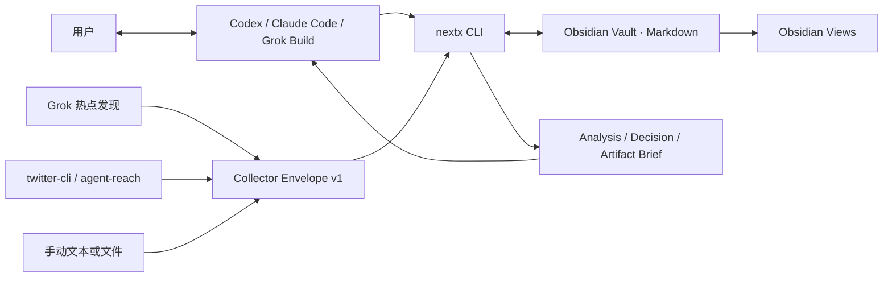
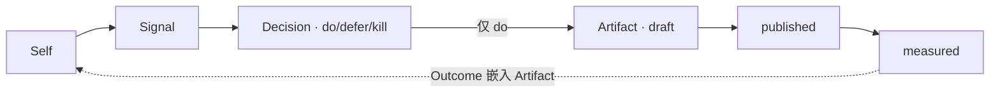

# NextX 产品与技术架构

NextX 是单账号、本地优先的 X 运营决策工作台。Agent 对话承担操作和推理，Obsidian 承担数据、看板与人工编辑，`nextx` CLI 承担确定性的校验、状态和文件写入。它不是纯终端产品，也不在 v0.1 开发独立前端。

## 设计目标

- 把 Signal 稳定压成 `do / defer / kill`，而不是扩大信息吞吐。
- 把 `do` 交给现有写作 Skill，20 分钟内形成可发草稿。
- 每个判断可追溯到证据，每个结果可回写到原判断。
- 用户拥有纯 Markdown 数据，不被某个模型、Agent 或数据库锁定。
- Collector、Agent 和 View 可以替换，四个领域原语保持稳定。

v0.1 不做自动发布、多账号、团队权限、Web UI、微服务、远程数据库或任意代码插件系统。

## 运行形态

用户可以全程在 Agent 对话中操作，也可以直接运行 CLI；Obsidian 是人工审查和修改界面。CLI 输出版本化 JSON，因此未来可以在不改数据层的前提下增加 Obsidian 插件、TUI、MCP 或 Web 客户端。

## 架构选择

采用“模块化单体 + 进程外 Collector 契约”：

- Python 3.11+ 标准库 CLI，无运行时依赖。
- JSON-compatible frontmatter + Markdown 正文是权威存储。
- `collector-envelope.v1` 是 Grok、CLI 工具和其他语言采集器的公共边界。
- Today、Decision Board、Bookmark Inbox、Weekly Review 是可覆盖重建的 Projection。
- Agent 只负责需要语言推理的环节；Python 负责输入校验、幂等、状态机、原子写入和审计。

这比微服务更适合单账号、每天十余条候选的本地工作负载，同时保留清楚的替换边界。现代化在这里体现为稳定契约、结构化输出、可恢复状态和测试，而不是更多基础设施。

## 组件职责

| 组件 | 职责 | 不负责 |
| --- | --- | --- |
| Agent Skill | 自然语言路由、读取最小上下文、调用其他 Skill | 权威状态、直接改写历史记录 |
| NextX CLI | 采集导入、校验、幂等、状态转换、Brief、Projection | 内容判断、正文创作、发布 |
| Grok Build | 开放式 X 热点发现、补充研究、输出统一 Envelope | 直接写 Vault、替代证据 |
| twitter-cli / agent-reach | Bookmarks、指定账号/帖子和指标的精确读取 | 决定是否发帖 |
| `topic-engine` | 证据驱动的选题裁决 | 写正文 |
| `x-tweet-writer` | 三温度草稿与发布前检查 | 选择选题、自动发布 |
| Obsidian | 浏览、链接、人工编辑、看板 | 业务状态机 |

## 领域模型与状态

只有四个持久化原语：

Learn 是读取历史记录的周流程，不是第五个对象。Decision 的裁决状态和 Artifact 的制作状态彼此独立，避免“选题值得做”和“帖子是否已发布”混为一谈。

所有记录带 `schema_version: 1` 和 `account_key: primary`。首版不开放多账号，但从记录层避免未来迁移全部文件。

## 数据与一致性

- 写入采用同目录临时文件 + 原子替换。
- 一个 Vault 使用全局写锁；本地单用户吞吐足够，避免并发覆盖。
- Collector 输入先整批校验，再写任何文件。
- X 原帖使用 `x:<tweet-id>` 幂等；手动文本使用内容 hash。
- 已有记录默认不覆盖；Projection 随时可删后重建。
- 运行状态和清单放在 `.nextx/`，不复制私密帖子全文。

发生中断时，权威 Markdown 仍可读。Views 或未来派生索引损坏时从记录重建，不做双写数据库。

## X 数据可行性

| 能力 | v0.1 实现 | 边界与降级 |
| --- | --- | --- |
| 热点发现 | Grok Build 输出 Envelope JSON | 必须保留原帖 URL；无证据摘要不能单独支撑 `do` |
| Bookmarks | 本机 `twitter-cli bookmarks --json` | X 私有接口可能变化；失败时 `doctor` 给出能力错误 |
| 准实时收藏 | macOS launchd 每 180 秒轮询 | X 没有公开 Bookmark webhook；休眠期间暂停，唤醒后补拉 |
| 指定账号/帖子 | agent-reach/twitter-cli | 受登录状态和 X 风控影响，可退回 URL 手动导入 |
| 深度拆解 | 只给模型发送选定 Signal 的 Brief | 本地存储不等于本地推理，内容会发给所选模型提供方 |
| 发布 | 用户在 X 人工完成，再回填 URL | NextX 永不自动发帖 |

“实时同步”在产品上定义为在线时 1–5 分钟内可见，不虚构不存在的推送能力。

## 扩展边界

首版只稳定四个扩展点：

1. Collector：任何进程或 Agent 只要输出 `schemas/collector-envelope.v1.json` 即可接入。
2. CLI JSON：Agent、未来 UI 和调度器不解析人类日志。
3. Projection：新看板读取四类记录，不改变权威数据格式。
4. Markdown repository：未来可加派生索引或其他工作区实现，原始文件保持可迁移。

不提供单实现接口、动态类工厂或任意 Python 插件加载。出现第二个真实实现时再抽象。

## 数据规模演进

目标规模是单账号 10,000 Signal、2,000 Decision、2,000 Artifact。v0.1 直接扫描 Markdown；若真实机器上全量扫描持续超过 500ms，增加可完全重建的 `.nextx/index.json`。只有单 Vault 超过 100,000 条且 JSON 索引仍不足时，才考虑 SQLite 派生索引。Markdown 始终是权威源。

多账号、独立前端、官方 X OAuth、自动 Outcome、MCP Server 等均由实际使用数据触发，不预埋空架构。

## 安全与开源边界

- Cookie、Token、OAuth 密钥不进入 Vault 或 Git。
- 所有 X 集成默认只读，发布和 Playbook 更新有人类确认闸门。
- 仓库不复制第三方 AGPL 实现；只使用公开协议和独立实现的产品模式。
- canonical Skill 只有一份，供不同 Agent 共用，避免规则漂移。
- 对外发布前固定许可证、支持的 twitter-cli 版本和安全披露流程。

完整产品规则见 `docs/superpowers/specs/2026-08-07-nextx-complete-product-design.md`，可执行公共契约见 `schemas/collector-envelope.v1.json`。
