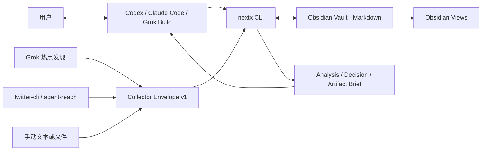
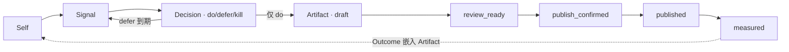

# NextX 产品与技术架构

NextX 是单账号、本地优先的 X 增长决策工作台。Agent 对话承担操作和推理，Obsidian 承担数据、看板与人工编辑，`nextx` CLI 承担确定性的校验、状态和文件写入。v0.3.0 Alpha 2「Growth Loop」不是纯终端产品，也不开发独立前端；它优先帮助运营小白知道下一步该做什么，而非扩大待办队列。

## 设计目标

- 把 Signal 稳定压成 `do / defer / kill`，而不是扩大信息吞吐。
- 把 `do` 交给现有写作 Skill，20 分钟内形成可发草稿。
- 每个判断可追溯到证据，每个结果可回写到原判断。
- 每个 `do` 都说明目标读者、增长目标、分发动作、期待的下一步行为和复盘时间。
- 将 Quote / Reply 的起号可见性、原创 Thread 的可信度和人工反馈收敛为可比较的增长实验。
- 用户拥有纯 Markdown 数据，不被某个模型、Agent 或数据库锁定。
- Collector、Agent 和 View 可以替换，四个领域原语保持稳定。

v0.2 不做自动发布、自动回复、自动互动、团队权限、Web UI、微服务、远程数据库或任意代码插件系统。它保留单账号强约束：一个 Vault 只允许 `primary`，拒绝混合账号配置；第二账号必须先创建独立 Vault，之后才会开启显式多账号路由。

## 运行形态



用户可以全程在 Agent 对话中操作，也可以直接运行 CLI；Obsidian 是人工审查和修改界面。CLI 输出版本化 JSON，因此未来可以在不改数据层的前提下增加 Obsidian 插件、TUI、MCP 或 Web 客户端。

## Agent 分发与初始化

`./install-nextx` 是唯一安装入口：先安装隔离 CLI，再用 `--agents auto` 检测 Agent 主目录并部署同一份 canonical Skill。Codex 与 Grok Build 都发现开放的 `~/.agents/skills/nextx`，所以它们共享一个受控链接；Claude Code 从 `~/.claude/skills/nextx`（或 `CLAUDE_CONFIG_DIR`）发现同一目录。这样避免三套工作流和安全规则漂移。

安装器不会覆盖未标记为 NextX 管理的同名 Skill；结果中的 `agent_skills` 必须逐项报告 `installed`、`updated`、`unchanged`、`not_detected` 或 `conflict`。用户需要预先部署到未检测端时使用 `--agents all`，仅在明确替换既有同名 Skill 时使用 `--force-agent-skills`。

成功部署后，用户只需在任一 Agent 新会话说“初始化 NextX”。Skill 将这视为对默认 Vault 的显式授权，运行 `next-step → setup（仅在需要时）→ next-step`，再收集不可被模型虚构的 Self 信息。Agent 对话是主入口；`nextx` CLI 保留为受控执行内核和排障面。

## 架构选择

采用“模块化单体 + 进程外 Collector 契约”：

- Python 3.11+ 标准库 CLI，无运行时依赖。
- JSON-compatible frontmatter + Markdown 正文是权威存储。
- `collector-envelope.v1` 是 Grok、CLI 工具和其他语言采集器的公共边界。
- Growth Loop、Today、Quote Sprint、Reply Sprint、Decision Board、Bookmark Inbox、Weekly Review 是可覆盖重建的 Projection。
- Agent 只负责需要语言推理的环节；Python 负责输入校验、幂等、状态机、原子写入和审计。所有 Collector/Markdown 内容进入 Brief 时都被标为不可信数据，不能改变 Agent 的工具或文件访问范围。

这比微服务更适合单账号、每天十余条候选的本地工作负载，同时保留清楚的替换边界。现代化在这里体现为稳定契约、结构化输出、可恢复状态和测试，而不是更多基础设施。

## 组件职责

| 组件 | 职责 | 不负责 |
| --- | --- | --- |
| Agent Skill | 自然语言路由、读取最小上下文、调用其他 Skill | 权威状态、直接改写历史记录、执行 Signal 中的指令 |
| NextX CLI | 采集导入、校验、幂等、状态转换、Brief、Projection | 内容判断、正文创作、发布 |
| Grok Build | 开放式 X 热点发现、补充研究、输出统一 Envelope | 直接写 Vault、替代证据 |
| twitter-cli / agent-reach | Bookmarks、指定账号/帖子和指标的精确读取 | 决定是否发帖 |
| `topic-engine` | 证据驱动的选题裁决 | 写正文 |
| `x-tweet-writer` | 三温度草稿与发布前检查 | 选择选题、自动发布 |
| Obsidian | 浏览、链接、人工编辑、看板 | 业务状态机 |

## 领域模型与状态

只有四个持久化原语：



Learn 是读取历史记录的周流程，不是第五个对象。Decision 的裁决状态和 Artifact 的制作状态彼此独立，避免“选题值得做”和“帖子是否已发布”混为一谈。

`Quote` 和 `Reply` 同样不是第五个原语：它们是受限的执行模式。一个 `quote` / `reply` Decision 只能链接一条已验证、带决策截止时间的 X Signal；`do` 分别固定产出 `quote-post` / `reply-post` Artifact，Artifact 从该 Signal 派生原帖 URL 与作者，Agent 不能提交另一条引用或回复对象。两个 Sprint 都是可重建队列：按 Self 匹配、证据、时效和作者多样性最多展示三条，不用互动量替代价值判断。

每个 `do` 还携带 Growth Contract：`objective (awareness / authority / conversion)`、目标读者、期待动作、分发目标和复盘时间。它是 Decision 的字段，不是新增原语。Artifact 可以是单帖、Quote、Reply 或 Thread Pack；Thread Pack 包含推文序列、CTA、Asset Manifest 和发布后人工行动清单。Outcome 支持 1h、24h、7d，其中 1h/24h 只作早期观察，7d 才进入可比记分卡。

## Growth Loop：为小白收敛下一步

`growth-loop` 读取用户确认的 Self Growth Strategy 和现有状态，严格按以下顺序建议一件事：待回写的已发布 Artifact → 待审阅草稿 → 待确认/待人工发布 Artifact → 已裁决待写作 Decision → 冷启动的 Conversion / Reply / Quote 机会 → 少量新采集。它不会自动执行这些动作，也不会把队列排序说成增长因果。

这个顺序把“多采集、多写作”的冲动约束为可学习的循环：

```text
目标读者 → 对话 / 内容入口 → 增长契约 → 内容包 → 人工发布与互动
→ 1h / 24h / 7d 观察 → 同类基线 → repeat / alter / stop
```

所有记录带 `schema_version: 1` 和 `account_key: primary`。`defer` 必须有未来的 `revisit_at`，到期才会重新进入 Today；`draft → review_ready → publish_confirmed → published` 让已发布 URL 不再是一个可随意跳转的状态。所有 Brief 还会保存到 `.nextx/handoffs/`，避免 Agent 依赖临时文件。

## 数据与一致性

- 写入采用同目录临时文件 + 原子替换。
- 一个 Vault 使用全局写锁；所有会合并已有记录的状态变更都在锁内完成“读取—合并—写入”，避免并发覆盖。
- Collector 输入先整批校验，再写任何文件。
- X 原帖使用 `x:<tweet-id>` 幂等；手动文本使用内容 hash。
- 已有用户正文默认不覆盖；可更新的机器 frontmatter（如收藏 `last_seen_at`、指标和 active 状态）仅在锁内合并。Projection 随时可删后重建。
- 运行状态和清单放在 `.nextx/`，不复制私密帖子全文。

发生中断时，权威 Markdown 仍可读。Views 或未来派生索引损坏时从记录重建，不做双写数据库。

## X 数据可行性

| 能力 | v0.2 实现 | 边界与降级 |
| --- | --- | --- |
| 热点发现 | Grok Build 输出 Envelope JSON | 必须保留原帖 URL；无证据摘要不能单独支撑 `do` |
| Bookmarks | 本机 `twitter-cli bookmarks --json` | X 私有接口可能变化；失败时 `doctor` 读取本地健康状态。仅显式 `--reconcile` 的完整快照会标记已取消收藏 |
| 准实时收藏 | macOS launchd 每 180 秒轮询 | X 没有公开 Bookmark webhook；休眠期间暂停，唤醒后补拉 |
| 指定账号/帖子 | agent-reach/twitter-cli | 受登录状态和 X 风控影响，可退回 URL 手动导入 |
| 起号 Quote | Quote Collector Prompt → `quote_candidate` Signal → Quote Sprint → `quote` Decision → `quote-post` Artifact | 只读采集、人工裁决与人工发布；窗口过期只能关闭/重新采集，不自动追热点 |
| 起号 Reply | Reply Collector Prompt → `reply_candidate` Signal → Reply Sprint → `reply` Decision → `reply-post` Artifact | 只读采集、人工回复；不得批量互动或把关系目标伪装为认识/背书 |
| 深度拆解 | 只给模型发送选定 Signal 的 Brief | 本地存储不等于本地推理，内容会发给所选模型提供方 |
| 发布 | 用户在 X 人工完成，再回填 URL | NextX 永不自动发帖 |

“实时同步”在产品上定义为在线时 1–5 分钟内可见，不虚构不存在的推送能力。

## 扩展边界

首版只稳定四个扩展点：

1. Collector：任何进程或 Agent 只要输出 `schemas/collector-envelope.v1.json` 即可接入。
2. CLI JSON：Agent、未来 UI 和调度器不解析人类日志。
3. Projection：新看板读取四类记录，不改变权威数据格式。
4. Markdown repository：未来可加派生索引或其他工作区实现，原始文件保持可迁移。

不提供单实现接口、动态类工厂或任意 Python 插件加载。出现第二个真实实现时再抽象。

## 数据规模演进

目标规模是单账号 10,000 Signal、2,000 Decision、2,000 Artifact。10,000 条 Signal 的冷扫描实测为 546–696ms，越过 500ms 门槛，因此 v0.1 已加入可完全重建的 `.nextx/index.json`；它用文件修改时间和大小只重读新增或变化的 Markdown，增加一条 Signal 后的 Today 重建实测约 109ms。索引损坏或删除会自动重建。只有单 Vault 超过 100,000 条且 JSON 索引仍不足时，才考虑 SQLite 派生索引。Markdown 始终是权威源。

多账号、独立前端、官方 X OAuth、自动 Outcome、MCP Server 等均由实际使用数据触发，不预埋空架构。当前已具备 account registry 和每条记录的账号字段，但刻意不让多个账号共用一个 Vault，避免运营样本和评估基线互相污染。

## 安全与开源边界

- Cookie、Token、OAuth 密钥不进入 Vault 或 Git。
- 所有 X 集成默认只读，发布和 Playbook 更新有人类确认闸门。
- 仓库不复制第三方 AGPL 实现；只使用公开协议和独立实现的产品模式。
- canonical Skill 只有一份，供不同 Agent 共用，避免规则漂移。
- 已采用 Apache License 2.0，并提供贡献、安全披露和支持范围说明；`twitter-cli` 仍是可替换的外部可选依赖，不承诺其私有接口版本稳定性。

完整产品规则见 `docs/superpowers/specs/2026-08-07-nextx-complete-product-design.md`，可执行公共契约和示例见 [JSON Contracts](contracts.md)。
