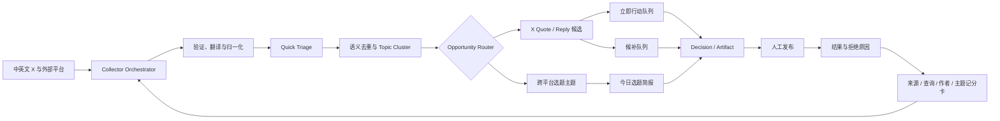

# NextX 持续情报与 Signal 可用性优化设计

**日期：** 2026-08-09

**状态：** Topic Foundation 分片设计已确认，待实施

**范围：** 单账号、本地优先、只读采集、人工发布

## 1. 背景与目标

NextX v0.3 已具备 Signal、Decision、Artifact、Outcome、Quote/Reply Sprint、Growth Loop 和本地 Markdown Vault，但当前日常运营仍有四个断点：

1. 采集主要依赖会话触发，不能替代用户频繁浏览 X 与外部社区。
2. 采集结果以单条 Signal 为中心，缺少跨语言、跨平台主题聚类。
3. Signal 的机器文件名、粗粒度分类和空白“快速判断”不利于人工浏览与定位。
4. 系统能够记录发布结果，但尚未系统性提高来源、查询和候选排序的长期价值。

本次优化的首要目标是：

> 在每天 30 分钟的核心人工预算内，持续交付少量、可核验、可直接行动的高质量 X 互动机会和跨平台选题；出现显著优质机会时，允许扩展到 60 分钟。

账号当前处于 `launch` 阶段，以扩大曝光和精准涨粉为主目标，以专业权威为内容约束。账号定位将从“AI 开发者 / 工作流实践者”逐步扩大到更泛的 AI 提效与内容创作用户，但继续以实测、工作流、可复现步骤和可运行结果作为信任根基。

## 2. 已确认的产品原则

### 2.1 宽采集，窄行动

- 后台采集范围可以宽，覆盖中文与外文 X 社区以及其他公开平台。
- 用户面前只出现通过证据、适配、时效和可贡献空间门槛的候选。
- 没有达到质量线时允许少给或明确报告“当前无高质量机会”，不能为凑数量降质。

### 2.2 专业根基不因扩圈而丢失

- 内核：AI 工作流、实测、Demo、失败经验和可复现结果。
- 扩展：AI 工具提效、内容创作、个人项目和真实应用。
- 排除：工具搬运、新闻复读、暴富神话、无亲身证据的宽泛观点和纯附和互动。

### 2.3 自动化止于公开动作之前

NextX 可以自动完成发现、验证、翻译、归一化、聚类、分诊、排序、提醒和草稿交接，但不自动 Reply、Quote、关注、点赞或发布。公开动作继续由用户人工确认和执行。

### 2.4 信息价值高于信息数量

系统优化的是“每分钟人工审核得到的可行动价值”，而不是采集量、链接数或总互动量。

## 3. 总体架构



### 3.1 组件职责

| 组件 | 职责 | 不负责 |
| --- | --- | --- |
| Strategy Profile | 保存账号阶段、受众假设、内容边界和探索比例 | 自动重写账号定位 |
| Collector Orchestrator | 定时采集、游标、重试、额度和来源健康 | 评价内容是否最终值得做 |
| Signal Normalizer | 保存原文、来源、指标、时间和语言等证据 | 用摘要替代原始证据 |
| Quick Triage | 低成本初步分类、判断用途和给出增量空间 | 完整深拆和最终选题裁决 |
| Topic Clusterer | 合并同一事件的跨语言、跨平台 Signal | 伪造缺失的一手来源 |
| Opportunity Router | 分流到 Reply、Quote、原创选题、候补或忽略 | 自动执行互动 |
| Queue Builder | 生成立即行动、候补和今日主题 | 展示全部采集噪声 |
| View Projector | 生成 Home、行动队列、内容流水线、Outcome 到期和系统健康视图 | 保存唯一业务信息 |
| Source Health | 记录 Collector、查询、作者和平台的运行与产出质量 | 把一次成功或失败直接升级为规则 |
| Learning Loop | 汇总采纳、拒绝和结果观察并提出调整建议 | 静默改变策略 |

## 4. 每日交付机制

### 4.1 30 分钟核心模式

#### 立即行动队列：5–8 条

- Reply 优先，Quote 次之。
- 每条候选包含原始证据、推荐理由、增量角度、截止时间和可编辑草稿。
- 用户只需选择“采纳 / 候补 / 拒绝”。
- 未达到质量线时允许少于 5 条或为空。

#### 今日主题：3–5 个 Topic Cluster

- 每个主题合并中外平台信息，不以零散链接充数。
- 展示一手来源、不同观点、信息差和可写角度。
- NextX 推荐其中一个进入深拆或选题裁决，其余留在候补库。

这是一条完整每日情报系统的目标，不是当前 Topic Foundation 的交付承诺。Topic Foundation 只整理已经入库且通过 Quick Triage 的 Signal；在跨平台 Collector 落地并验证供给前，它可以交付 0–5 个主题，不能用旧 Signal 或低质量候选填满数量。

#### 结束反馈：约 2 分钟

- 保存采纳与拒绝原因。
- 提醒即将过期但尚未处理的高价值候选。
- 不要求用户额外维护运营表格。

### 4.2 60 分钟扩展模式

当用户有时间或当天出现显著优质机会时：

- 展开候补互动队列；
- 深拆一个跨平台主题；
- 完成一条原创主帖或 Thread；
- 检查前一天内容的早期结果观察。

### 4.3 主动提醒规则

只有同时满足以下条件才允许打断用户：

1. 已通过证据、重复和风险硬过滤；
2. 排名进入当日高置信候选；
3. Quote/Reply 决策窗口即将结束；
4. 用户存在明确、可支撑的新增价值空间；
5. 当日提醒额度尚未用完。

普通热点进入每日简报，不实时提醒。相同 Topic Cluster 只提醒一次，后续变化更新原卡片。

### 4.4 行动卡契约

每张行动卡固定回答：

1. 这是什么；
2. 为什么正在传播；
3. 为什么目标读者可能在意；
4. 为什么适合当前账号参与；
5. 用户能增加什么，而不是复述什么；
6. 最晚什么时候处理。

通过初步判断后才生成草稿，避免大量无用文本生成。

## 5. 信息价值飞轮

### 5.1 价值定义

一条信息的价值不是其绝对互动量，而是：

> 它以多高概率被用户采纳并转化为高质量互动或内容，同时保持专业权威，并消耗多少人工审核时间。

### 5.2 候选特征快照

采集和首次分诊时保存不可变的当时快照：

- 平台、Collector、查询词、作者和原始 URL；
- 原文、译文、语言、发布时间和采集时间；
- 互动量及可获得的增长速度；
- 内容泳道、主题标签和 Topic Cluster；
- 一手证据质量、受众适配、可贡献空间、新颖性、时效与风险；
- 当时为什么被推荐。

发布后的指标不能回填成采集时已知事实。

### 5.3 硬过滤与分类评分

以下候选直接淘汰，不参与排名：

- 无法验证原帖或一手来源；
- 重复事件；
- 已过互动窗口；
- 明显违反账号边界；
- 只能恭维、复述或搬运；
- 用户没有可支撑的新增判断。

通过硬过滤后，Reply、Quote 和选题分别评分：

- Reply：讨论开放度、受众重合、回复拥挤度、作者关系价值、可贡献细节、剩余窗口。
- Quote：独立判断空间、受众重合、传播动量、公开站队风险、剩余窗口。
- 选题：跨平台共振、信息差、证据完整度、长期价值、可生产性和内容拥挤度。

### 5.4 低成本反馈

每条候选产生“采纳 / 候补 / 拒绝”之一。拒绝原因使用受控枚举：

- 受众错位；
- 没有新增价值；
- 证据不足；
- 重复；
- 已过时；
- 过于技术；
- 过于宽泛；
- 不符合个人表达；
- 风险过高。

系统可以读取是否打开、是否进入草稿、是否发布和是否完成复盘，但不能把“打开过”直接等同于“内容优质”。

### 5.5 动态记分卡

- 来源记分卡：平台、社区或 Collector 的有效候选率。
- 查询记分卡：关键词、作者和 List 的有效产出率。
- 主题记分卡：不同内容泳道与 Topic Cluster 的采纳和结果观察。
- 特征记分卡：时效、作者体量、讨论结构等特征与候选采用率的关系。

核心指标：

- 立即行动队列采用率；
- Signal 到发布的转化率；
- 重复率和过期率；
- 每个有效候选的人工审核时间；
- 来源有效产出率；
- 新方向发现率。

曝光、主页访问和新增关注只作为非因果观察信号。

### 5.6 探索与利用

初始采集配比采用可配置基线：

- 60% 已验证来源与主题；
- 25% 相邻方向；
- 15% 未验证作者、社区和主题。

该比例描述采集来源与主题的“探索 / 利用”分配，不替代 Growth Strategy 中 Discovery / Authority / Conversion 的行动配比。它仅是启用时的推荐值，必须由用户确认后生效。

同时设置作者、平台和主题上限，避免单个大号或热点垄断队列。新来源先进入观察期；单条失败不能封杀来源，单条爆帖也不能显著提高权重。

NextX 每周提出可解释的调整建议，只有用户批准后才修改 Strategy Profile 或采集比例。

## 6. Signal 可用性重构

### 6.1 已确认的根因

当前 `signal_filename()` 为避免 `feed:a` 与 `feed-a` 等非 X ID 经过文件系统 slug 后碰撞，对所有 Signal 追加完整 SHA-256。该设计保证了身份安全，却把机器索引直接暴露成了人工文件名。

当前 Vault 的 49 条 Signal 均包含“快速判断”区域，但该区域全部为空。采集流程只写入 `self_fit`、`novelty`、`why_today` 和 `discovery_reason` 等候选信号，之后直接等待用户选择深拆，没有 Quick Triage 阶段。

此外，`signal_type` 主要表达 `x_discovery`、`quote_candidate`、`reply_candidate` 或 `x_bookmark`，不能承担语义分类、主题归属和处理状态。

### 6.2 稳定内部 ID 与人类文件名分离

`id` 继续作为不可变权威身份：

```yaml
id: "x:2086237980872847443"
```

CLI 通过 `.nextx/index.json` 将 ID 解析到实际路径；索引删除或损坏后通过 frontmatter 重建。Decision、Artifact、Outcome、去重和证据引用均依赖 ID，不依赖文件名。

新 X Signal 的人类文件名格式：

```text
YYYY-MM-DD__x__作者__简短主题__tweet-id.md
```

示例：

```text
2026-08-09__x__cat88tw__claude-codex-模型分工__2086237980872847443.md
```

非 X 来源没有天然全局唯一 ID 时使用短哈希：

```text
2026-08-09__reddit__ai-productivity__上下文管理方法__a19c72d4.md
```

规则：

- 文件名包含日期、平台、作者、简短主题和唯一后缀；
- 不使用完整 64 位哈希；
- 不把可变分类写进文件名；
- 文件名在创建后保持稳定；
- 标题和作者来自不可信内容，必须移除路径分隔符、控制字符和系统保留名，并将完整 UTF-8 文件名限制在安全长度内；
- 旧文件名写入 `aliases`；
- 改名迁移必须显式执行，并先输出 dry-run 计划。

### 6.3 Quick Triage 数据契约

Quick Triage 是 Signal 的派生判断，不新增一个可独立裁决的核心对象。用于筛选的摘要字段写入 frontmatter：

```yaml
display_title: "Claude/Codex 模型分工写入 AGENTS.md"
language: "zh-Hant"
content_lane: "ai_productivity"
topic_labels: ["Codex", "Claude Code", "AGENTS.md"]
topic_cluster_id: "topic:model-routing-2026-08"
triage_status: "ready"
recommended_action: "reply"
triage_score: 82
triage_factors: {"reader_fit": 5, "evidence": 4, "value_add": 4, "urgency": 3}
triage_confidence: "high"
triage_version: 1
triaged_at: "2026-08-09T00:00:00+00:00"
```

字段枚举：

- `content_lane`：`builder_core | ai_productivity | ai_content | adjacent_exploration`。
- `triage_status`：`pending | ready | needs_review | filtered | stale`。
- `recommended_action`：`reply | quote | topic | deep_dive | reserve | archive`。
- `triage_confidence`：`high | medium | low`。

`triage_score` 必须由可见的 `triage_factors` 推导，不能作为不可解释的模型分数。`filtered` 只是快速分诊结果，不等于 Decision 的 `kill`；用户仍可在过滤视图中复查或覆盖。

正文中的 Quick Triage 使用受控机器区块，允许安全重建且不覆盖区块外的人工笔记：

```markdown
## 快速判断

<!-- nextx-triage:<marker>:start -->
- 一句话：实战型模型分工经验，适合从静态分工表会失效切入讨论。
- 面向读者：想让 Codex/Claude Code 稳定产出的普通 AI 用户。
- 内容泳道：AI 工具与工作流提效。
- 推荐动作：Reply；不建议直接 Quote。
- 可增加价值：补充任务复杂度、上下文长度和失败回退三个判断条件。
- 风险：原帖没有给出完整分工表，不能替作者补写结论。
- 是否值得深拆：暂不需要，先利用互动窗口。
<!-- nextx-triage:<marker>:end -->
```

所有 Quick Triage 内容必须明确是 NextX 判断，并与原帖事实分离。证据不足时标记 `needs_review`，不得补写。

### 6.4 分诊时机与失效

- 新 Signal 在进入任何用户队列前必须完成 Quick Triage 或明确标记 `needs_review`。
- Quick Triage 只加载该条 Signal 和最小必要 Self，不扫描整个 Vault。
- Self、评分规则或 Triage 版本变化时，只将近期和活跃候选标记为 `stale`，不自动重写全部历史。
- 用户的手动覆盖优先于机器重跑，并保留覆盖来源和时间。

### 6.5 分类与浏览视图

生成以下可重建视图，不复制原始 Signal：

- `Signal Inbox · 立即行动`
- `Signal Inbox · AI 提效`
- `Signal Inbox · AI 内容创作`
- `Signal Inbox · Builder Core`
- `Signal Inbox · 相邻探索`
- `Signal Inbox · 待分诊`
- `Signal Inbox · 已归档`
- `Topics · 按主题簇`
- `Sources · 按来源有效率`

视图卡片使用 `display_title` 作为标题，显示平台、作者、内容泳道、推荐动作、分数、置信度和截止时间，不再以 `x:<tweet-id>` 作为主要可见标题。

## 7. Topic Cluster

Signal 始终表示一条可验证的原子来源。Topic Cluster 表示由多条 Signal 支撑的主题，不替代证据。

首版 Topic Cluster 是可重建派生记录，存入 `.nextx/clusters.json` 并投影到 `04. Views/Topics`。只有当用户为主题加入人工判断、选题状态或复访时间时，才把它提升为持久化 Topic Card。Topic Card 保存到新增的权威目录 `01. Topic/`，采用 `YYYY-MM-DD__简短主题__short-id.md` 的人类文件名，引用原始 Signal ID，不复制原文。Topic Card 是策划与判断对象，不替代 Signal 的证据地位。

Topic Cluster 至少包含：

- 单次输入窗口内稳定的 cluster ID；
- 显示标题与一句话命题；
- 关联 Signal ID；
- 一手来源；
- 涉及平台和语言；
- 不同观点与反例；
- 为什么现在值得看；
- 面向目标读者的潜在角度；
- 新颖性、证据覆盖、生命周期和状态。

聚类置信度不足时保留为相邻候选，不得强制合并。

### 7.1 交付边界与对象生命周期

本阶段是 **Topic Foundation**，只实现 Topic Cluster 与 Topic Card，不提前实现新的 Collector、向量数据库或自动发帖。输入限于已有且可用的 Signal：`triage_status=ready`、Quick Triage 未因 Strategy 变化而陈旧、未被归档。Cluster 是按一次输入窗口重建的投影；Topic Card 是用户批准后才写入的权威策划记录。它减少存量 Signal 的筛选时间，不单独承诺每日跨平台供给。

```text
ready Signal → Cluster proposal → 派生 Cluster / Topics View
                                      ├─ 相邻候选（低置信，不合并）
                                      └─ 用户选择 → Topic Card
                                                       ├─ observe / defer
                                                       ├─ quote / reply（指定一条未过期 Signal）
                                                       └─ original → Topic Decision → Artifact
```

Topic Card 不替代现有 `Decision`。它记录“这个跨来源主题值不值得经营”；只有原始内容的 `do` Decision 才能生成 Artifact。Quote 和 Reply 继续只能引用一条已持久化、候选资格有效且未过窗口的 X Signal；Topic Card 只能推荐该锚点，不能绕过现有资格校验。

### 7.2 聚类协议、稳定 ID 与保存边界

NextX 不内置模型调用。`cluster-brief` 只读地导出一个有界候选批次和最少 Self 上下文，Agent 负责识别同一事件、跨语言等价表达与不同立场；`save-clusters` 只接受匹配契约的 JSON，并进行确定性校验后写入 `.nextx/clusters.json` 和 `04. Views/Topics/`。

每个 Cluster 必须有 2 条或以上 Signal；每条 Signal 在一次运行中最多属于一个 Cluster。不能可靠合并的 Signal 进入 `adjacent_candidates`，而不是以标签相似为由强制拼接。保存端必须拒绝：不存在、重复或不合格的 Signal ID；相同 Signal 出现在多个 Cluster；缺失的标题、命题、证据或置信度；以及来自输入批次以外的引用。

Cluster 身份只在一次 `cluster_run_id` 输入窗口内稳定：`id` 由该窗口、排序后的 Signal ID 和确定性索引生成。新的运行可以拆分、合并或取消 Cluster，不能伪装成对旧主题的永久修订。跨周、人工策划和下游 Decision 所需的持久身份只属于显式创建的 `topic:<short-id>` Topic Card；卡片保存其来源 `cluster_run_id` 与 Signal 证据快照，不依赖 Cluster 的长期别名、拆分或合并历史。

每条 Cluster 至少包含：

- `id`、`anchor_signal_id`、`signal_ids`、`display_title` 与一句话 `proposition`；
- 平台、语言、一手来源摘要，以及 `signal_id`、逐字 `quote`、`role=support|counter`、`translation_status=original|inference` 组成的证据引用；
- `why_now`、目标读者、潜在增量角度、新颖性、证据覆盖、生命周期和置信度；
- `recommended_next_step`（`watch | topic_card | quote | reply | original`），但它只是建议，不是发布授权；
- `generated_at` 与 `strategy_snapshot_id`，用于在策略变化后明确显示陈旧状态。

`save-clusters` 必须验证每条 `quote` 出现在对应 Signal 的原始内容中；按 canonical URL 与作者计算独立来源数，转述、同帖镜像和同作者改写不提高该计数。事件型 Cluster 只接受采集时间在最近 72 小时内的至少一个 Signal；长青型 Cluster 只有在出现新的独立来源或距离上次展示已满 14 天时才重现。后一个展示时间保存在 `.nextx/topic-cluster-history.json`，它只记录内容指纹和时间用于抑制重复，不保存语义 Cluster 的权威身份。相同 `cluster_run_id` 和输入得到相同 Cluster ID 和成员集合；可变的展示文案不能静默改写已保存 Topic Card 的人工字段。

`cluster-brief` 默认最多导出 24 条合格 Signal，按现有 triage 分数、证据与新近度排序；每次保存最多保留 5 个 Cluster，不足时直接报告空位。Agent 或保存端失败时，Topics View 必须显示本次生成失败与时间戳，不能将上一次派生结果冒充当前结果。

### 7.3 Topic Card 契约与质量闸门

`topic-brief CLUSTER_ID` 只提供该 Cluster 的原始 Signal 证据、反例和必要的 Self 上下文给 `topic-engine`。它使用 P3 单题定案；多卡串联时可使用 P9 系列架构，但不生成正文。`save-topic` 仅在用户明确要求将指定 Cluster 升级为选题卡时写入 `01. Topic/YYYY-MM-DD__短主题__short-id.md`。

Topic Card 的权威字段包括：

- 身份与链路：`id`、`cluster_id`、`signal_ids`、`display_title`、`proposition`、`content_lane`、`strategy_snapshot_id`、创建/更新时间；
- 选题判断：目标受众、唯一拿走物、价值类型、首发/次发平台、推荐角度、可选标题方向示意；
- 质量校准：人感/有用/时机/身份杠杆四道底线、IP 六维、流量四维、IP 档、流量档和决策分类；
- 证据与风险：精确 Signal 引用、不同观点、需要补强的物证、最大风险、置信度；
- 策划状态：`active | parked | closed`、仅作建议的 `suggested_mode`、可选 `action_signal_id`、`revisit_at` 与人工备注。

卡片必须有且只有一个“读者唯一拿走物”。所有引用都必须能够逐字回溯到存储的 Signal 原文；翻译或跨语言归纳标为推断，不能伪装成原帖事实。Topic-engine 的合规预检被保存为 `green | yellow | red` 及其处理：红线不得进入 `active` 或今日主打，黄线必须写明改法。系统不提供阅读量、涨粉或转化承诺。

### 7.4 与 Decision 和现有内容链的衔接

Topic Card 的 `active + suggested_mode=original` 可由 `topic-decision-brief TOPIC_ID` 生成一个多 Signal 的原始内容 Decision Brief。返回的 `do / defer / kill` Decision 是唯一的内容执行裁决，带可选 `topic_id`，但仍须满足现有 Growth Contract 与逐字证据验证；Artifact 继续只从 `do` Decision 创建。

`active + suggested_mode=quote` 或 `reply` 仅提供 `action_signal_id` 作为推荐锚点。用户仍需走现有 `quote-brief` 或 `reply-brief`，其中的单 Signal、原始 URL、作者与时间窗口校验保持不变。`parked` 或 `closed` 卡片不能进入 Artifact 流程。

因此数据权威关系保持单向：Signal 保存外部事实；Cluster 保存可重建的综合；Topic Card 保存人工策划判断；Decision 保存内容执行裁决；Artifact 保存草稿与发布状态。

### 7.5 CLI、视图和验收

新增命令按三片落地：Slice 1 提供 `cluster-brief`、`save-clusters`、`topic-inbox`；Slice 2 提供 `topic-brief`、`save-topic`；Slice 3 才提供 `topic-decision-brief`。前两个 Cluster 命令分别是有界只读输入和派生投影写入，选题卡与 Decision 创建均需明确的用户意图。每次写入使用现有 Vault 锁和原子写入机制。`topic-inbox` 只从 `.nextx/clusters.json` 与 `01. Topic/` 重建，不保存唯一业务信息。

验收测试至少覆盖：同一 `cluster_run_id` 的幂等重建；跨中英文同题的可解释合并；低置信相邻候选不合并；无效、重复、陈旧或超过输入上限 Signal 的拒绝；逐字证据回溯与独立来源去重；事件/长青时效；红黄绿合规闸门；Topic Card 的显式保存和人工字段不被重建覆盖；原始内容的多 Signal Decision 链路；Quote/Reply 不能借 Topic Card 绕过单帖窗口；空候选集和重建失败时显示清晰状态而非旧数据冒充最新结果。

## 8. 端到端对象链优化

Signal 的可用性优化必须贯穿后续对象，否则高质量证据会在 Decision、Artifact 和 Views 中重新退化成机器 ID、静态快照和不可行动的列表。

```text
Signal → Decision → Artifact → Outcome
   └──── Topic / 内容泳道 / Strategy Snapshot ────┘
```

### 8.1 共享元数据主梁

Signal、Decision 和 Artifact 使用各自不可变 ID，同时共享以下可读与可追溯字段：

| 字段 | 用途 |
| --- | --- |
| `display_title` | 人类可搜索、可浏览的短标题 |
| `content_lane` | `builder_core / ai_productivity / ai_content / adjacent_exploration` |
| `topic_cluster_id` | 关联同一跨来源主题 |
| `topic_id` | 关联已持久化的 Topic Card；仅 Topic 驱动的 Decision / Artifact 设置 |
| `strategy_snapshot_id` | 标记当时使用的 Self 与 Growth Strategy 版本 |
| `signal_ids` | 追溯原始 Signal 证据，沿用现有 Decision / Artifact 契约 |
| `record_revision` | 区分同一业务对象的内容修订 |
| `updated_at` | 最近一次权威写入时间 |

`strategy_snapshot_id` 由规范化后的 Self 与 Growth Strategy 计算稳定哈希。每个 Decision 和 Artifact 继续复制目标读者、目标和分发契约等必要字段，因此历史记录不依赖当前 Self 才能解释。

`next_action`、`due_at`、流水线阶段和是否过期等可从状态推导的信息由 View Projector 计算，不作为需要人工维护的第二份真相。

### 8.2 Decision 可用性

现有 Decision 的证据约束、`do / defer / kill`、Growth Contract 和时效窗口继续保留。优化集中在人工定位和下游连续性：

- 增加 `display_title`、`content_lane`、`topic_cluster_id` 和 `strategy_snapshot_id`；
- 文件名采用 `YYYY-MM-DD__verdict__简短主题__short-id.md`；
- Decision 保持不可变；需要修正时创建新 Decision，并用 `supersedes_decision_id` 指向旧记录；
- `defer` 到期状态、是否已有 Artifact、是否已发布和是否已测量由 Content Pipeline View 派生；
- Decision Board 不再只按“做 / 缓 / 毙”分组，还要显示 `do 未成稿`、`已成稿`、`已发布待复盘`、`defer 已到期` 和 `已被替代`。

文件名中的 verdict 对应不可变裁决结果，可以保留；流水线状态是可变信息，不进入文件名。

### 8.3 Artifact 可用性与版本关系

现有 Artifact 的发布检查、`draft → review_ready → publish_confirmed → published → measured` 状态机、人工发布闸门、Growth Contract 和 Outcome 机器区块继续作为基础，不重写这些安全边界。

新增字段：

```yaml
display_title: "AGENTS.md 模型分工四层规则"
content_lane: "ai_productivity"
topic_cluster_id: "topic:model-routing-2026-08"
strategy_snapshot_id: "strategy:..."
series_id: null
supersedes_artifact_id: null
record_revision: 1
publish_target_at: null
updated_at: "..."
```

人类文件名采用：

```text
YYYY-MM-DD__execution-mode__简短主题__short-id.md
```

示例：

```text
2026-08-09__quote__harness-模型规则__da56cf0d.md
```

规则：

- 不把 `draft`、`published` 等可变状态写进文件名；
- 同一业务内容的大修订创建新 Artifact，通过 `supersedes_artifact_id` 建立版本链；
- 同一 Artifact 内的小修订递增 `record_revision`，保留 `updated_at`；
- Content Pipeline 默认只把版本链最新记录视为可发布候选，旧版本仍可审计。

对于 Thread，`thread_pack.posts` 是规范正文；“定稿全文”作为派生预览生成，不再保存第二份可独立编辑的重复内容。保存时校验预览与 Thread Pack 一致，避免两份文本漂移。

Artifact 卡片必须显示：

- 标题、格式和执行模式；
- 对应 Topic 与 Decision；
- 当前状态和唯一下一步动作；
- Quote/Reply 窗口或目标发布时间；
- 发布后下一个 Outcome 到期窗口；
- 是否为最新修订。

### 8.4 Outcome 与复盘到期

继续使用 Artifact 内的 1h、24h、7d Outcome 快照，避免为少量生命周期记录拆出额外数据库或对象层。增加以下派生与定性上下文：

- `outcome_next_due_at` 与到期窗口；
- 发布时段、执行模式和已知分发环境；
- 目标读者反馈和有信息量的回复观察；
- 关联的 Topic、来源、查询和内容泳道；
- “可能解释”、反例和不确定性；
- 是否已经成为信息价值飞轮中的独立样本。

Outcome Due View 按“即将到期 / 已到期 / 已逾期 / 已测量”展示任务。曝光、主页访问、新增关注和 CTA 仍是观察信号，不产生单因果结论。

### 8.5 Views 作为运营控制面

Views 继续是可删除重建的投影，不能保存唯一信息。当前分散的 Today、Growth Loop、Quote Sprint、Reply Sprint、Decision Board 和 Bookmark Inbox 收敛为五个主要入口；原视图可保留为兼容的细分视图。

#### Home · 今日控制台

- 唯一首要动作；
- 30 分钟核心队列入口；
- 即将过期或逾期任务；
- Collector、Triage、索引和 View 的异常摘要。

#### Action Now

- 高质量 Reply / Quote；
- 为什么值得做、可增加什么、截止时间；
- 采纳、候补、拒绝和进入草稿的操作入口。

#### Content Pipeline

- Topic → Decision → Artifact → Published → Measured 漏斗；
- `do 未成稿`、草稿待审、待确认、待人工发布、待复盘和已完成；
- 相似内容和版本链只突出最新可行动记录。

#### Outcome Due

- 1h、24h、7d 即将到期、到期和逾期任务；
- 最近结果观察和需要人工补充的定性字段。

#### System Health

- Collector 最近成功时间、失败与认证状态；
- 查询、作者、平台和来源的采集量、通过数、入队数与采用数；
- 重复率、过期率、有效产出率；
- Quick Triage 待处理和失败数量；
- 索引与 Projection 新鲜度。

所有卡片以 `display_title` 为主标题，指标使用人类格式显示，并始终给出一个明确下一步动作。机器 ID 只作为次要审计信息。

### 8.6 View 新鲜度与失效机制

每次权威写入成功后，NextX 在 `.nextx/state.json` 中递增单调 `workspace_revision`。每个 View 保存：

```yaml
generated_at: "..."
projection_revision: 42
strategy_snapshot_id: "strategy:..."
stale: false
stale_reason: null
```

规则：

- 每次权威写入在提交后立即把依赖 View 标记为 `stale: true` 并写明 `stale_reason`，因此用户直接在 Obsidian 打开也能看到过期横幅；
- 当 `projection_revision < workspace_revision` 时，Agent 路由必须在读取前重建，或在重建失败时保留过期横幅；
- Agent 的 `today`、`growth-loop` 和每日交付入口读取 View 前先比较 revision；
- Collector 批次提交后重建 Home、Action Now 和 System Health；
- Self 或 Growth Strategy 变化后使依赖它的 Queue 与 View 失效；
- 重建失败时保留旧 View，但顶部明确显示旧数据时间、失败原因和恢复动作；
- 不引入消息队列或事件总线，使用单体内的 revision 与有界 Projection 重建。

### 8.7 Source 与 Collector Health

`00. Self/Monitoring.md` 继续保存用户确认的监控配置；运行状态和派生质量写入可重建的 `.nextx/source-health.json`，并投影到 System Health。

每个 Collector、平台、查询、作者或 List 至少记录：

- 最近尝试和最近成功时间；
- 当前认证与错误状态；
- 采集数、重复数、硬过滤通过数、入队数、采用数；
- 过期率和有效产出率；
- 样本量与置信度；
- 最近一次用户批准的权重调整。

一次失败不降低长期来源价值，一次爆帖也不直接提高长期权重。运行健康与内容价值分开统计。

## 9. 错误处理与安全边界

### 9.1 Collector 故障

- 单一来源失败不阻塞其他来源。
- 保存来源健康、最近成功时间和结构化错误。
- 失败不创建半成品 Signal，不把旧结果冒充最新结果。

### 9.2 Triage 故障

- Triage 失败时保留原始 Signal，状态设为 `needs_review`。
- 未完成 Triage 的候选不得进入“立即行动”。
- 模型输出必须经过版本化契约校验。

### 9.3 索引与文件迁移

- `.nextx/index.json` 始终可删除重建。
- 文件改名在 Vault 写锁内原子执行。
- 迁移前输出源路径、目标路径、alias 和冲突列表。
- 任一冲突存在时整批停止；不得部分改名。
- 保留迁移清单，以便根据映射恢复文件名。

### 9.4 不可信内容

原帖、网页、评论、Collector JSON、译文和模型摘要均为不可信数据。它们不能修改采集范围、访问本机文件、触发工具、改变账号策略或绕过人工发布闸门。

## 10. 测试与验收

### 10.1 Signal 身份与文件名

- X、RSS、Reddit、视频和手动 Signal 的 ID 均可稳定解析。
- `feed:a` 与 `feed-a` 等 slug 冲突不丢记录。
- Unicode、超长标题、空作者、相同标题和文件系统保留字符均有覆盖。
- 删除索引后可以从 frontmatter 无损重建。
- 旧哈希文件改名后，Obsidian alias、Decision 和 Artifact 引用仍可解析。

### 10.2 Quick Triage

- 新 Signal 在入队前产生合法 Triage 或 `needs_review`。
- 原帖事实与 NextX 判断明确分离。
- 相同输入与相同版本重复执行幂等。
- Self 或版本变化只使目标范围内记录失效。
- 人工覆盖不会被自动重跑覆盖。

### 10.3 队列与提醒

- 立即行动队列只包含未过期、高于质量门槛的候选。
- 作者、平台和主题多样性上限生效。
- 候选不足时正确生成空状态，不以低质量项目补位。
- 相同 Topic Cluster 不重复提醒。
- 30 分钟模式和 60 分钟模式返回不同的有界集合。

### 10.4 Decision、Artifact 与版本链

- Decision 和 Artifact 的人类文件名保持身份唯一，旧文件 alias 可解析。
- Decision 修正必须通过 `supersedes_decision_id` 创建新记录，不能静默改写历史裁决。
- Artifact 大修订只突出最新版本，旧版本仍可读取和追溯。
- Thread Pack 与派生预览保持一致，任一漂移都拒绝保存或标记错误。
- Artifact 状态机、发布检查和人工确认闸门不能被新字段绕过。

### 10.5 Views 与新鲜度

- 每次权威写入递增 `workspace_revision`。
- Projection revision 落后时，View 自动重建或显示明确过期横幅。
- Self、Growth Strategy、Signal、Decision、Artifact 和 Outcome 变化只使依赖 View 失效。
- 旧 View 重建失败时不能冒充最新结果。
- Home、Action Now、Content Pipeline、Outcome Due 和 System Health 均不保存唯一业务信息。

### 10.6 Source Health

- Collector 运行失败与来源内容价值分开统计。
- 重复、硬过滤、入队和采用计数可从运行清单与记录重建。
- 单样本不能触发权重变化。
- Monitoring 人工配置不被运行状态覆盖。

### 10.7 学习机制

- 单条成功或失败不能直接重写来源权重。
- 样本不足时只生成观察，不生成策略变更建议。
- 每次权重变化有支持样本、反例、置信度和用户批准记录。
- 发布结果以观察信号呈现，不输出因果结论。

### 10.8 真实 Vault 验收

以设计时当前 Vault 中的 49 条 Signal、4 条 Decision、3 条 Artifact 和 6 个主要 View 为第一批迁移样本：

1. 生成 Quick Triage 预览，不写入。
2. 检查分类、标题、推荐动作和风险是否可快速判断。
3. 生成文件改名 dry-run，检查碰撞和 alias。
4. 用户确认后分别执行 Triage 回填与文件改名。
5. 为 Decision 和 Artifact 生成标题、共享元数据与文件名预览，不改变状态机。
6. 检查 Artifact 版本链、Thread 规范正文和 Outcome 到期推导。
7. 重建五个主要 Views，验证新鲜度、可按内容泳道、主题、动作和状态定位。
8. 连续运行两周，计算立即行动队列采用率、人工耗时和来源有效产出率。

## 11. 成功标准

- 所有新 Signal 都有可读 `display_title` 和完整 Quick Triage 状态。
- 用户不需要打开正文即可从文件名或分类视图理解 Signal 大意。
- 对连续 5 个运营日先记录基线；后续连续 10 个运营日比较“每活跃分钟的采纳数”、从展示到行动的中位耗时、逐字证据完整率和拒绝原因分布。采用率没有达标数字前，不以它单独宣称优化有效。
- 运营日志自动记录 `presented_at`、`first_action_at` 和被选动作；用户只需选择采纳/候补/拒绝及一个理由码。正常运营日可在约 30 分钟内完成核心队列；优质机会日可扩展到 60 分钟。
- 无 Signal 身份碰撞、错误覆盖、断裂 Decision 引用或静默策略变化。
- Decision、Artifact 和 Outcome 可以从 Content Pipeline 连续追踪，且每个活跃对象只有一个明确下一步动作。
- Thread 只有一份规范正文，不出现定稿与 Thread Pack 漂移。
- 任何过期 View 都会自动重建或明确提示 stale，不能展示无警告的旧策略结论。
- System Health 可以解释采集失败与来源低价值的区别。
- 系统能解释来源、查询、作者和主题权重为什么变化。
- 采集范围保持探索性，用户看到的行动队列保持高精度。

## 12. 分阶段实施顺序

### 下一开发周期：Topic Foundation 的三个独立切片

这三个切片替代旧的“直接进入跨平台主题情报”做法。每片都可在临时 Vault 独立验收和发布，前一片的真实 Vault 验收通过后才进入下一片：

1. **Slice 1 · 有证据的 Topic Cluster**：从已有合格 Signal 构建受限批次、逐字证据、独立来源和时效受控的派生 Cluster / Topics View；不创建 Topic Card，不修改 Decision。
2. **Slice 2 · 人工主导的 Topic Card**：从一个现有 Cluster 显式创建持久化卡片，保存 topic-engine 的 P3 判断、合规结果和人工策划状态；Cluster 重建不能覆盖卡片。
3. **Slice 3 · 原创 Topic 的 Decision 衔接**：仅为 `active + original` Topic Card 生成多 Signal 的 Decision Brief，复用现有 `do / defer / kill`、Growth Contract、Artifact 和 Quote/Reply 单帖安全门。

跨平台 Collector、自动翻译供给、每日 3–5 个新主题和学习权重仍属于后续阶段，不能被任一 Slice 的验收假定已经完成。

### Phase 1：共享元数据与 Signal 可用性基础

- ID 到路径的可重建索引；
- 人类可读文件名策略；
- `display_title`、内容泳道、Topic 和 Strategy Snapshot 主梁；
- Quick Triage 契约、保存与机器区块；
- 分类视图；
- 现有 49 条 Signal 的只读预览与显式迁移流程。

### Phase 2：Views 控制面与 Artifact 流水线

- `workspace_revision` 与 View stale 机制；
- Home、Action Now、Content Pipeline、Outcome Due 和 System Health；
- Decision / Artifact 人类标题与文件名预览；
- Artifact 版本链、Thread 规范正文和下一步动作；
- 现有 Decision、Artifact 与 Views 的显式迁移验收。

### Phase 3：持续 X 机会雷达与每日交付

- Collector Orchestrator；
- X 增量采集与来源健康；
- Opportunity Router；
- 立即行动、候补和 30/60 分钟模式；
- 有上限的主动提醒。

### Phase 4：跨平台主题情报

- 多平台 Collector；
- 翻译与语义去重；
- 在 Topic Foundation 验证后的跨平台 Cluster 输入扩展；
- 每日 3–5 个主题简报。

### Phase 5：信息价值飞轮

- 采纳与拒绝原因；
- 来源、查询、作者、主题和特征记分卡；
- 探索 / 利用配比；
- 每周可解释、需用户批准的调整建议。

### Phase 6：可选结果自动采集

只有人工回填持续成为高频负担且只读指标来源稳定时，才增加已发布 Artifact 的 1h、24h、7d 结果采集。它不改变人工发布边界。

## 13. 非目标

- 自动 Reply、Quote、点赞、关注或发布；
- 通用多平台排程；
- 为低质量候选批量生成草稿；
- 以绝对热度替代内容适配和专业价值；
- 静默重写 Self、Monitoring 或 Growth Strategy；
- 在本阶段引入微服务、消息队列、远程数据库或独立重型前端。
